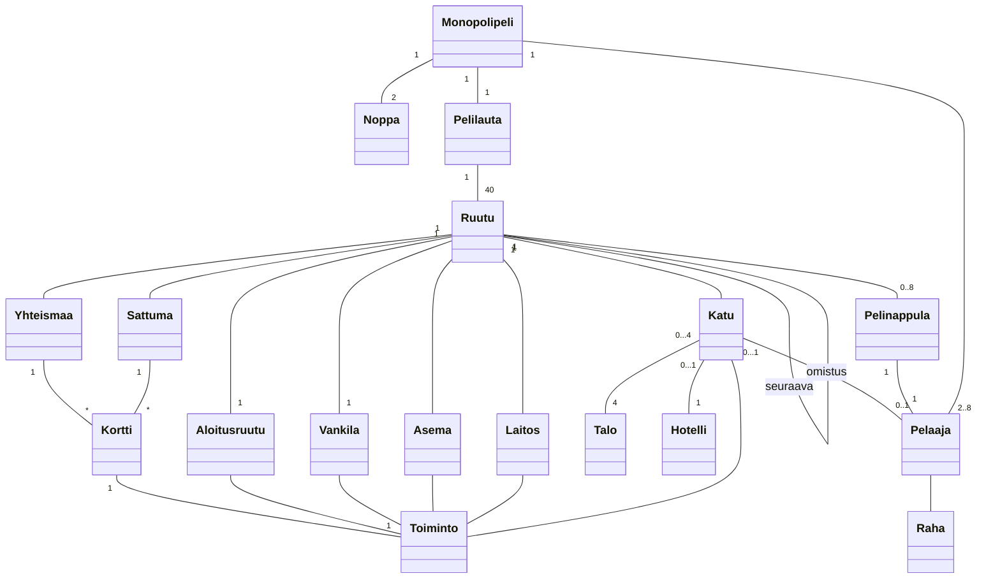

### Monopoli

```mermaid
 classDiagram
    Monopolipeli "1" -- "2" Noppa
    Monopolipeli "1" -- "1" Pelilauta
    Pelilauta "1" -- "40" Ruutu

    Ruutu "1" -- "1" Ruutu: seuraava

    Ruutu "1" -- "1" Aloitusruutu
    Ruutu "1" -- "1" Vankila
    Ruutu -- Sattuma
    Ruutu -- Yhteismaa
    Ruutu -- Asema
    Ruutu -- Laitos
    Ruutu -- Katu
    Ruutu "1" -- "0..8" Pelinappula

    Yhteismaa "1" -- "*" Kortti
    Sattuma "1" -- "*" Kortti
    Kortti "1" -- "1" Toiminto

    Aloitusruutu -- Toiminto
    Vankila -- Toiminto
    Asema -- Toiminto
    Laitos -- Toiminto
    Katu -- Toiminto

    Katu "0...4" -- "4" Talo
    Katu "0...1" -- "1" Hotelli
    Katu "0...1" -- "0..1" Pelaaja : omistus 

    Pelinappula "1" -- "1" Pelaaja
    Pelaaja "2..8" -- "1" Monopolipeli
    Pelaaja -- Raha

```
