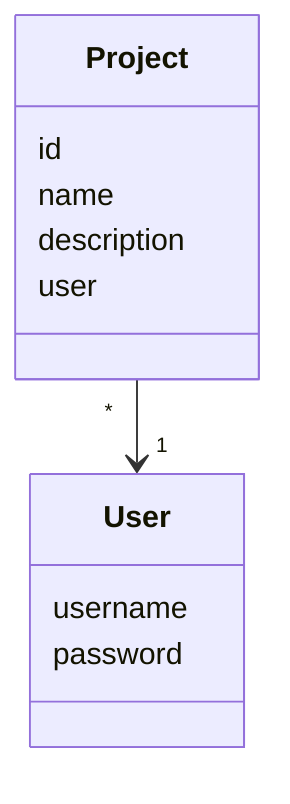

# Arkkitehtuurikuvaus

## Sovelluslogiikka

Sovelluksen loogisen tietomallin muodostavat luokat __User__ ja __Project__, jotka kuvaavat käyttäjiä ja käyttäjien projekteja.

Toiminnallisista kokonaisuuksista vastaavat luokat __UserService__ ja __ProjectService__, jotka tarjoavat käyttöliittymän tarvitsemat toiminnot, kuten:
- UserService.login(username, password)
- UserService.create_user(username, password)
- ProjectService.create_project(name, description)
- ProjectService.get_projects()

Palveluluokat käyttävät tietojen tallennukseen pakkauksessa repositories sijaitsevia luokkia __UserRepository__ ja __ProjectRepository__, joiden toteutukset injektoidaan palveluluokille konstruktorissa.