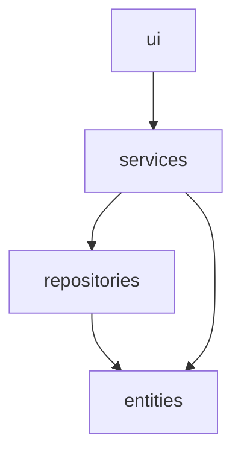
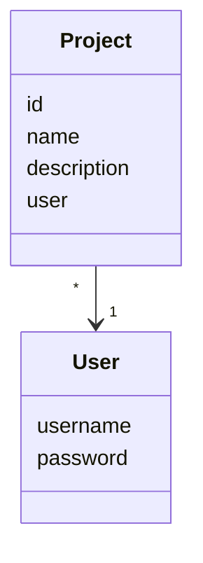
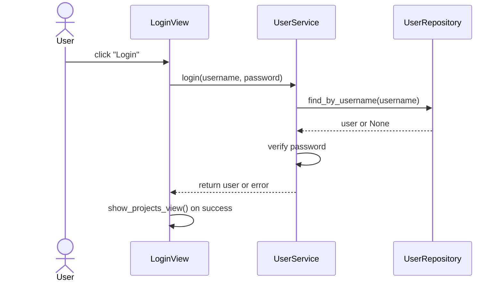
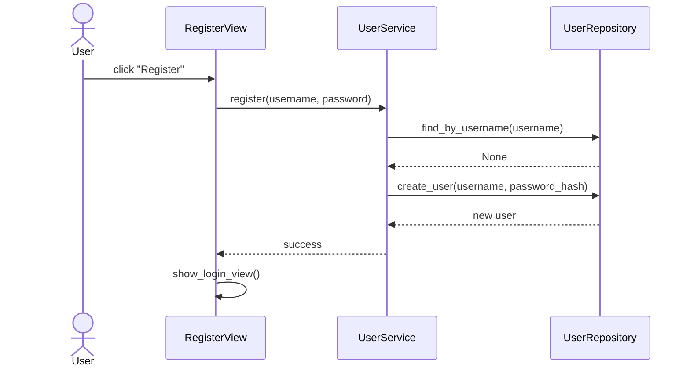
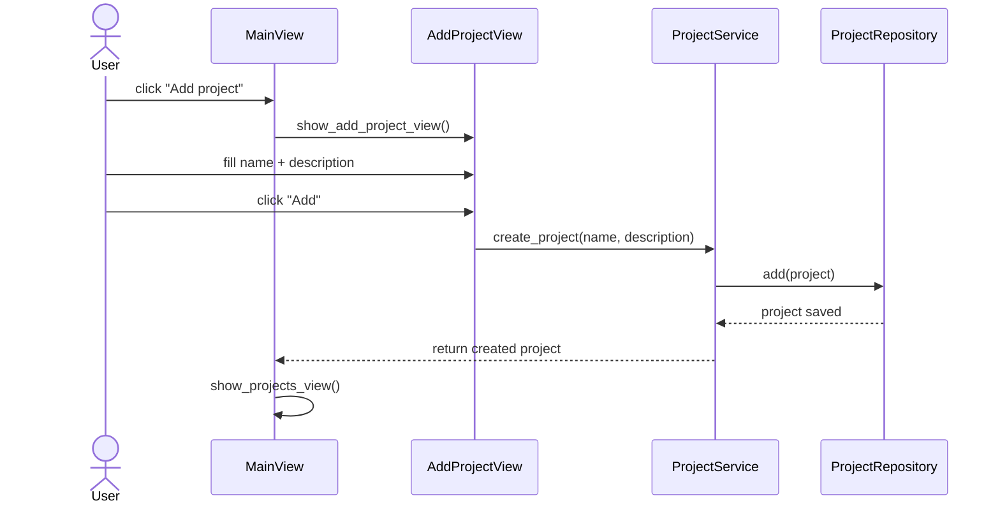

# Arkkitehtuurikuvaus

## Rakenne

Sovellus noudattaa kerrosarkkitehtuuria, jonka toiminnallisuus perustuu seuraavanlaiseen tapaan:

- ui/            → käyttöliittymä
- services/      → sovelluslogiikka
- repositories/  → tiedon tallennus
- entities/      → tietomallit

Sovelluksen pakkausarkkitehtuuri on seuraavanlainen:

## Käyttöliittymä

Sovelluksen käyttöliittymä sisältää kahdeksan erillistä näkymää:

- Kirjautuminen
- Rekisteröityminen
- Projektilista
- Projektin lisäys
- Projektin tarkastelu
- Projektin muokkaus
- Projektin nuottien hallinta
- Projektin nuottien tarkastelu

Näistä jokainen on toteutettu omana luokkana. Näkymiä pystyy olla vain yksi kerrallaan näkyvillä. Käyttöliittymän pääasiallisten näkymien hallinnasta vastaa `UI`-luokka. `MainView`-luokka taas vastaa projektin sisäisten näkymien hallinnasta `UI`-luokan avulla.

## Sovelluslogiikka

Sovelluksen loogisen tietomallin muodostavat luokat `User` ja `Project`, jotka kuvaavat käyttäjiä ja käyttäjien projekteja.

Toiminnallisista kokonaisuuksista vastaavat luokat `UserService` ja `ProjectService`, jotka tarjoavat käyttöliittymän tarvitsemat toiminnot, kuten:
- UserService.login(username, password)
- UserService.create_user(username, password)
- ProjectService.create_project(name, description)
- ProjectService.get_projects()

Palveluluokat käyttävät tietojen tallennukseen pakkauksessa repositories sijaitsevia luokkia `UserRepository` ja `ProjectRepository`, joiden toteutukset injektoidaan palveluluokille konstruktorissa.

## Tietojen pysyväistallennus

Tietojen tallettamisesta huolehtivat luokat ovat _repositories_ hakemiston luokat `UserRepository` ja `ProjectRepository`. Molemmat näistä luokista tallettavat tietoa SQLite-tietokantaan. 

## Sovelluksen päätoiminnallisuudet

Sovelluksen toimintalogiikkaa sekvenssikaavioina

### Käyttäjän kirjautuminen

Sovellukseen kirjautuminen tapahtuu niin, että ensin _Username_ ja _Password_ syötekenttiin kirjoitetaan käyttäjätunnus ja salasana. Tämän jälkeen klikataan nappia _Login_. Sovelluksen kontrolli etenee seuraavasti:

### Käyttäjän rekisteröinti

Sovelluksen rekisteröitymisnäkymään päästään kirjautumisnäkymästä klikkaamalla nappia _Register as user_. Käyttäjä kirjoittaa _Username_ syötekenttään käyttäjänimen, joka ei ole vielä käytössä sekä _Password_ ja _Password again_ kohtiin samat salasanat. Rekisteröityminen vahvistetaan klikkaamalla _Register_ nappia. Sovelluksen kontrolli etenee seuraavasti:

### Projektin luonti

Käyttäjä voi lisätä näytelmä- sekä musikaaliprojekteja sovellukseen klikkaamalla nappia _Add project_. Sovelluksen kontrolli etenee seuraavasti:

## Ohjelmaan jääneet heikkoudet

### Käyttöliittymä

Graafinen käyttöliittymä koostuu useista eri luokista ja tiedostoista, jotka mahdollistavat sovelluksen toiminnallisuuden. Mikäli sovellusta olisi vielä edistetty, tiedostojen välisestä kommunikoinnista olisi tullut helposti epäselviä. Käyttöliittymässä on myös jonkun verran toistoa, mikä lisää virheiden riskiä.

### Suuret tietomäärät

Käyttöliittymässä suuri määrä dataa tekee sovelluksesta helposti haastavan. Sovelluksessa ei ole filtteröinti tai haku mahdollisuutta, joten suurten tietomäärien käsittely ei ole käyttäjän kannalta sujuvaa. Sovelluksessa ei ole sivutustoimintoa, joten projektit, päivämäärät ja PDF-tiedostot muodostavat pitkän listan.

### Sovelluksen alustus

Sovelluksen käyttöönotto edellyttää komennon _poetry run invoke build_ tai sovellus ei ole käyttökelpoinen. Komento muodostaa sovellukselle tietokantayhteyden ja alustaa tarvittavat tietokantataulut. Sovellusta ei ole mahdollista käyttää ilman tietokantaa. Komennon tärkeyttä on korostettu monessa eri kohdassa sovelluksen dokumentaatiossa, mutta mikäli se silti jää käyttäjältä huomioimatta, ei sovellusta saada toimimaan ollenkaan. Tällöin sovellus antaa virheilmoituksen, mutta ei selkeää ohjausta ongelman korjaamiselle. Tämä heikentää käyttöönoton sujuvuutta ja käyttäjän käyttökokemusta.